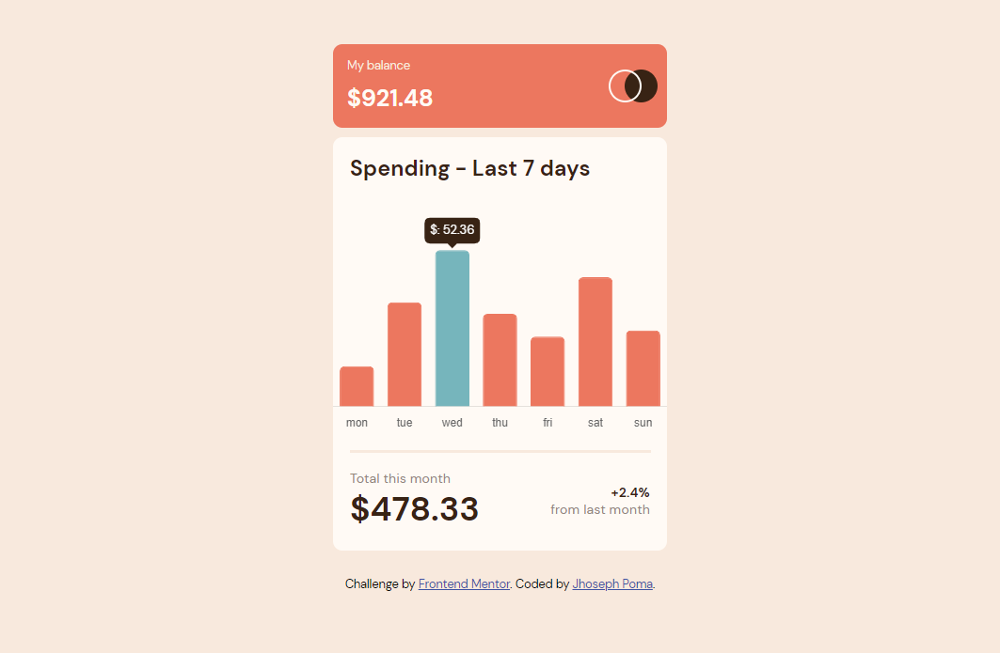

# Frontend Mentor - Expenses chart component solution

This is a solution to the [Expenses chart component challenge on Frontend Mentor](https://www.frontendmentor.io/challenges/expenses-chart-component-e7yJBUdjwt). Frontend Mentor challenges help you improve your coding skills by building realistic projects.

## Table of contents

- [Overview](#overview)
  - [The challenge](#the-challenge)
  - [Screenshot](#screenshot)
  - [Links](#links)
- [My process](#my-process)
  - [Built with](#built-with)
  - [What I learned](#what-i-learned)
  - [Useful resources](#useful-resources)
- [Author](#author)

## Overview

### The challenge

Users should be able to:

- View the bar chart and hover over the individual bars to see the correct amounts for each day
- See the current day’s bar highlighted in a different colour to the other bars
- View the optimal layout for the content depending on their device’s screen size
- See hover states for all interactive elements on the page
- **Bonus**: Use the JSON data file provided to dynamically size the bars on the chart

### Screenshot



### Links

- Solution URL: [Add solution URL here](https://github.com/rtzboy/frontEndMentor01.git)

## My process

### Built with

- Semantic HTML5 markup
- CSS custom properties
- Flexbox
- Mobile-first workflow

### What I learned

chartJS library, this helped me to complete this challenge quickly.

things ive learned

```html
<canvas id="myChartJs" width="335" height="235"></canvas>
```

```js
const arrDay = result.map(({ day }) => day);
const amountDay = result.map(({ amount }) => amount);
const totalAmount = amountDay.reduce((acum, num) => acum + num, 0);
```

### Useful resources

- [Chart.js](https://www.chartjs.org/) - This helped me write chart bar quickly. Useful resource i liked so much.
- [MapReduceFilter](https://youtu.be/tP8JiVUiyDo) - This is an amazing video that helped me finally understand concepts about map reduce filter. I'd recommend it.

## Author

- Facebook - [JhosephPoma](https://www.facebook.com/joseph.22.12/)
- Frontend Mentor - [@rtzboy](https://www.frontendmentor.io/profile/rtzboy)
